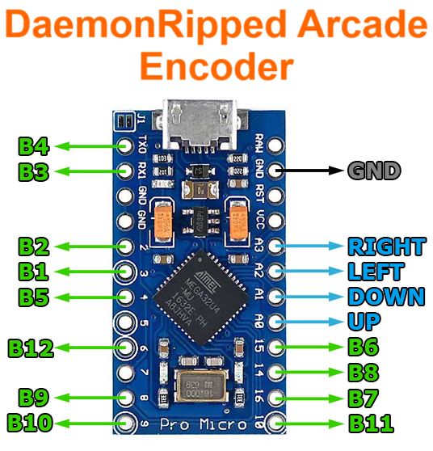

# DaemonRipped Arcade Encoder
This is an arcade controller board based on [MickGyver's DaemonBite](https://github.com/MickGyver/DaemonBite-Arcade-Encoder), but removing all optionals features (PS3, NeoGeo and debug). A four-direction stick and up to 12 buttons are supported. It uses any standard Arduino Pro Micro board.  

Debounce optional feature has been kept. It is activated by default, as it adds only around 0.035ms of latency. 10ms setting for debounce should be an ideal value, lowering it might cause problems, and it shouldn't be any higher than 20ms.  
 
## Performance:
The input lag for an arcade controller or adapter built around this project is minimal. Here is the result from a [test with a native polling rate of 1ms](https://inputlag.science/controller/methodology):  

#### DaemonRipped Arcade Encoder (tested with debouncing on):
| Samples | Average | Max | Min | Std Dev | % On next frame |
| ------ | ------ | ------ | ------ | ------ | ------ | 
| 1000 | 0.72ms | 1.19ms | 0.41ms | 0.24ms | &nbsp; &nbsp; &nbsp; &nbsp; &nbsp; 96% |  

   
  

-Just for comparison, this is the latency for a common low latency controller:
#### Sony DualShock 4 (Bluetooth) (native polling rate 1ms):
| Samples | Average | Max | Min | Std Dev | % On next frame |
| ------ | ------ | ------ | ------ | ------ | ------ |
| 1000 | 3.00ms | 12.0ms | 2.20ms | 0.70ms | &nbsp; &nbsp; &nbsp; &nbsp; &nbsp; 83% |  

#### Sony DualShock 4 (Wired) (native polling rate 4ms):
| Samples | Average | Max | Min | Std Dev | % On next frame | 
| ------ | ------ | ------ | ------ | ------ | ------ |
| 1000 | 10.3ms | 12.4ms | 7.50ms | 1.20ms | &nbsp; &nbsp; &nbsp; &nbsp; &nbsp; 39% |  

   

## Wiring:  
The wiring is simple. Connect one leg of each microswitch to GND and the other leg to the digital pin according to the schematic below:  

 
## Programming the Arduino board:  
1. Solder J1 on the Arduino Pro Micro (to properly run 5v for 16Mhz).
2. Download and install the free Arduino IDE: https://www.arduino.cc/en/main/software.
3. Connect the Arduino Pro Micro to a USB port and let the drivers install.
4. Open up Arduino IDE, then click on File > Preferences. Towards the bottom of the window, paste this URL into the "Additional Board Manager URLs" text box: https://raw.githubusercontent.com/sparkfun/Arduino_Boards/main/IDE_Board_Manager/package_sparkfun_index.json.
5. Click on Tools > Board > Board Manager. Search for 'sparkfun' in the Board Manager. You should see the SparkFun AVR Boards package appear. Click install. Close Arduino IDE.
6. Open the file "C:\Users\YOUR-USER\AppData\Local\Arduino15\packages\SparkFun\hardware\avr\1.1.13\boards.txt" and edit the name that the USB joystick device will have, in the string "promicro.build.usb_product=". Change the value of "promicro.build.vid=" if using more than one joystick, for them to be unique.
7. Click on Tools > Board: > SparkFun AVR Boards > SparkFun Pro Micro.
8. Click on Tools > Port: > COM Port.
9. Click on Tools > Processor: > ATmega32U4 (5V, 16 Mhz).
10. Click Compile/Upload the project.
